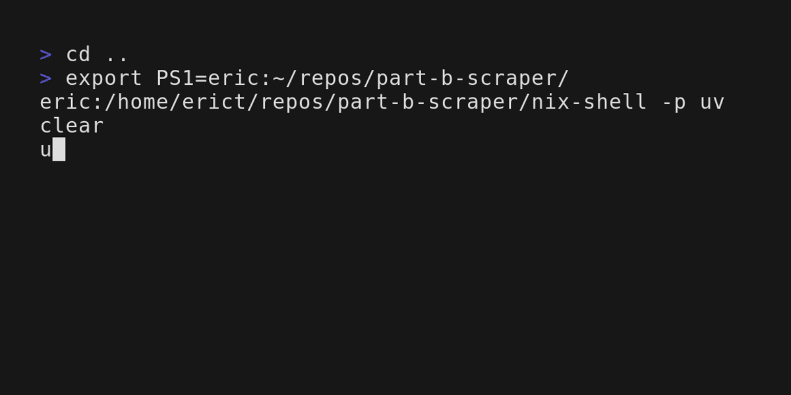

# Part B Fee Schedule Scraper PoC

## Overview

Run locally extract Part B schedules from [Part B Schedules](https://pa.gov/agencies/dli/programs-services/workers-compensation/wc-health-care-services-review/wc-fee-schedule/part-b-fee-schedules.html) and collect output in a single `.csv` file.



## Scope

For the initial proof of concept, this scraper is built to run locally produce output in a single `.csv` file.

## Getting Started

### Running the Scraper

1. Clone this repository!

```bash
git clone https://github.com/ericTrautsch/type-b-scraper.git
```

#### Run via [`python`](https://www.python.org) (requires `python`)

**With [`uv`](https://docs.astral.sh/uv/) installed**
```bash
uv run src/main.py
```

**Windows (Git Bash)**
```bash
python -m venv .venv
. .venv/Scripts/activate
pip install -r requirements.txt
python src/main.py
```

**Linux (Bash)**
```bash
python -m venv .venv
. .venv/bin/activate
pip install -r requirements.txt
python src/main.py
```

#### Run via [`Docker`](https://www.docker.com) (requires `docker`)

**Linux** (Works on windows, but output may not produce outside of container)
```bash
docker build . -t part-b-scraper
docker run --volume output:. part-b-scraper
```

### Viewing the output

The output file will exist in `output.csv` in the repository directory.

## Details

### Data Scraping

Part B Fee Schedules are scraped and downloaded in [`src/scrape_data.py`](./src/scrape_data.py). Files are downloaded to a top-level `data/` directory to store these files.

### Data Extraction

`.pdf` files in the top level `data/` directory are processed, extracting and concatenating tables from the pdf files. The tables are collected and saved to `output.csv`. Implemented in [`src/process.py`](./src/process.py)

### Entrypoint

The current `python` level entrypoint into the application is located in [`src/main.py`](./src/main.py). This file is around for creating a top level flow, eg: scraping documents and then processing.

In the future, this could be built into a lambda function or similar.

## Possible Next Steps

This Proof of Concept is limited. If proven useful, here are some actions that could be taken to improve & bring this project beyond PoC.

- Building deployment pipeline and infrastructure
- Modifying entrypoint to be a lambda function or similar
- Building more expansive tests
  - Ensure that when documents churn on the website, it is known if this service is correctly functioning or not
- Defining triggers; ensure the resulting pipeline is triggered
- Log the updated fee schedules to a database/etc (see [`save`](./src/process.py)) 
- Retain historical records of changes to fee schedules (See first paragraph of [Part B Schedules](https://pa.gov/agencies/dli/programs-services/workers-compensation/wc-health-care-services-review/wc-fee-schedule/part-b-fee-schedules.html))


